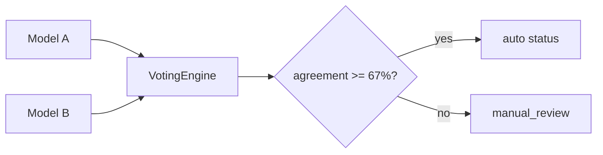
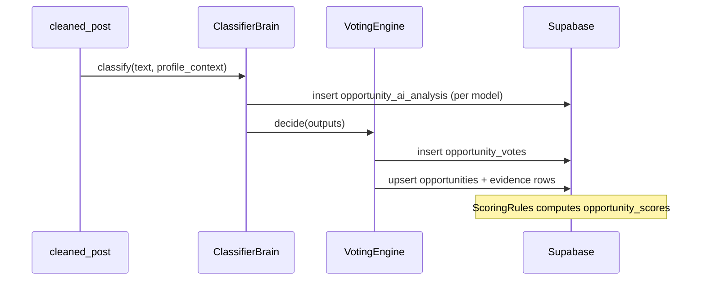

# AI Brain Rules — Classification, Voting, and Evidence

**Purpose:** Convert `cleaned_posts` into structured `opportunities` with traceable evidence, controlled cloud spend, and agreement across models.

---

## 1. Design goals

| Goal | Mechanism |
|------|-----------|
| **Accuracy** | Multi-model voting + profile context |
| **Traceability** | Mandatory evidence snippets for high confidence |
| **Cost control** | Ollama first, cloud quota, content-hash cache |
| **Safety** | Strict JSON schema; invalid output discarded |
| **Consistency** | Rule-based scoring after AI extraction |

---

## 2. Brain responsibilities (Stage 1)

| Brain / module | Responsibility | Output |
|----------------|----------------|--------|
| **ClassifierBrain** | Category, subcategory, relevance, summary | `opportunity_ai_analysis` per model |
| **VotingEngine** | Resolve disagreements | `opportunity_votes`, final status |
| **ai_json_validator** | Schema + evidence gate | reject invalid JSON |
| **ScoringRules** | Deterministic 0–100 score | `opportunity_scores` |
| **Future: ExtractorBrain** | Contacts, deadlines, funding fields | detail tables |
| **Future: RemoteProofBrain** | `remote_restriction` + snippet | `remote_job_details` |

Stage 1 wires **ClassifierBrain** + **VotingEngine** in `scripts/run_ai_analysis.py` (production connection in progress).

---

## 3. Model stack and call order

**Clients:** `backend/app/ai_brains/clients/`

| Order | Client | Env key | Role |
|-------|--------|---------|------|
| 1 | `OllamaClient` | `OLLAMA_BASE_URL` | Free local inference when running |
| 2 | `GroqClient` | `GROQ_API_KEY` | Fast cloud fallback |
| 3 | `GeminiClient` | `GEMINI_API_KEY` | Strong structured output |

**ClassifierBrain.classify()** logic:

1. Build prompt: classification template + `PROFILE` + `POST` (truncated 12k chars).
2. Iterate clients in order; skip if `is_available()` false.
3. `complete_json()` → `parse_and_validate()`.
4. Collect up to **2 valid outputs** then stop (cost/latency tradeoff).
5. Pass outputs to `VotingEngine.decide()`.

Optional cloud models (not in default classify loop but reserved):

| Client | Key | Use case |
|--------|-----|----------|
| OpenAI | `OPENAI_API_KEY` | Tie-breaker / extractor |
| Anthropic | `ANTHROPIC_API_KEY` | Long document PhD ads |
| HuggingFace | `HF_TOKEN` | Embedding or small models |

---

## 4. Multi-model voting

**Module:** `voting_engine.py`

### 4.1 Inputs

Each model output dict should include:

| Field | Used for |
|-------|----------|
| `category` | Vote counting |
| `recommended_status` | Status vote |
| `confidence` | Averaging and bands |
| `is_relevant` | Pre-filter (future: skip scoring if false) |

### 4.2 Decision algorithm

1. Plurality vote on `category` and `recommended_status`.
2. `agreement_ratio = top_category_votes / N`.
3. `avg_conf` = mean model confidence.
4. **Manual review triggers:**
   - `agreement_ratio < 0.67`, OR
   - `avg_conf < 50`
5. Confidence band adjustment:
   - Unanimous: `min(95, avg_conf + 10)`
   - ≥67% agree: `avg_conf`
   - Else: `max(30, avg_conf * 0.6)` and force `manual_review` status

### 4.3 Vote persistence

`opportunity_votes` stores:

- `vote_round` (e.g. `stage1_classify_v1`)
- `models_used` JSON array
- `agreement_ratio`, `final_category`, `final_status`, `final_confidence`
- `decision_json` full audit blob



---

## 5. Daily cloud quota

| Setting | Default | Location |
|---------|---------|----------|
| `AI_DAILY_CLOUD_CALL_LIMIT` | 200 | `.env`, GitHub Actions `vars` |

### 5.1 Quota accounting

Increment `api_usage_logs` per cloud call with:

- `service_name`: `groq`, `gemini`, `openai`, etc.
- `units_used`: 1 per completion (or token count when available)
- `metadata`: `content_hash`, `model_name`

### 5.2 Pre-cloud gates (required before spend)

| Gate | Implementation |
|------|----------------|
| Content-hash cache | Skip if `opportunity_ai_analysis.content_hash` exists |
| Quality gate failed | Never call AI |
| Rule pre-filter | Keyword blocklist (spam, adult, pure real estate) — extend in pipeline |
| Quota check | If cloud calls today ≥ limit, use Ollama-only or defer |

### 5.3 Ollama vs cloud policy

| Condition | Policy |
|-----------|--------|
| Ollama available | Always try first; does not count against cloud quota |
| Ollama unavailable | Cloud models with quota |
| Quota exhausted | Queue remainder for next day; mark `manual_review` if urgent |

---

## 6. JSON schema (model output)

**Validator:** `ai_json_validator.py` — `REQUIRED_FIELDS`:

| Field | Type | Description |
|-------|------|-------------|
| `is_relevant` | boolean | False → archive/low score |
| `category` | string | `client_lead`, `phd`, `job`, `remote_job`, `manual_review` |
| `title` | string | Normalized title |
| `summary` | string | 2–4 sentence summary |
| `confidence` | number | 0–100 model self-score |
| `reason` | string | Human-readable justification |
| `evidence` | array | Snippet objects (see below) |
| `model_name` | string | Set by client after parse |

### 6.1 Evidence array objects

| Property | Required | Example |
|----------|----------|---------|
| `type` | yes | `funding_proof`, `remote_proof`, `email_proof` |
| `snippet` | yes | Verbatim quote from post |
| `offset` | no | Char offset in body |

### 6.2 Evidence enforcement rule

```
IF confidence > 70 AND evidence is empty → REJECT parse (high_confidence_requires_evidence)
```

This prevents high-score hallucinations without quotes.

### 6.3 Extended fields (recommended in prompt, optional in validator)

| Field | Maps to |
|-------|---------|
| `subcategory` | `opportunities.subcategory` |
| `recommended_status` | voting |
| `country`, `city` | opportunity row |
| `organization` | `organization` |
| `funding_status` | `phd_opportunity_details` |
| `remote_restriction` | `remote_job_details` |
| `email_application_possible` | job/phd details |

Prompt file: `backend/app/ai_brains/prompts/classification_prompt.md` (create/expand with field definitions).

---

## 7. Persistence flow



### 7.1 Evidence table mapping

Each evidence item → `opportunity_evidence`:

| Column | Source |
|--------|--------|
| `evidence_type` | `type` |
| `snippet` | `snippet` |
| `source_offset` | `offset` |
| `model_name` | producing model |
| `confidence` | model or snippet confidence |

---

## 8. Profile context injection

Retrieve from:

1. `user_profiles` + `profile_skills` + `profile_experience` (structured).
2. Top-k Profile RAG chunks for post keywords (Chroma query).

Format in prompt:

```
PROFILE:
- Location: Bremen, Germany
- Skills: Python, RAG, FastAPI, ...
- Avoid: self-funded PhD, US-only remote, native German required jobs
...
POST:
{cleaned body}
```

Keep profile section under ~2k tokens; RAG fills specialty gaps.

---

## 9. Category-specific AI expectations

| category | Must extract | Must not infer without snippet |
|----------|--------------|--------------------------------|
| `client_lead` | contact method, need type | phone numbers not in text |
| `phd` | funding_status, deadline | “fully funded” without quote |
| `job` | skills, languages | salary not in text |
| `remote_job` | remote_restriction | worldwide remote without proof |

---

## 10. Logging and audit

| Table | Purpose |
|-------|---------|
| `ai_model_runs` | Latency, tokens, status per call |
| `api_usage_logs` | Cost tracking |
| `audit_logs` | Manual overrides, quota breaches |

Never log raw API keys or full post bodies in production logs (use hashes).

---

## 11. Failure handling

| Failure | Action |
|---------|-------|
| Invalid JSON | Skip model; try next client |
| All models invalid | `status = manual_review` |
| Quota exceeded | Defer post; increment backlog metric |
| Timeout | Log `ai_model_runs.status = error`; retry once |

---

## 12. Prompt versioning

Store `scoring_version` / prompt version in:

- `opportunity_scores.scoring_version` = `stage1_v1`
- `opportunity_votes.vote_round` = `stage1_classify_v1`

When prompts change, bump version and optionally re-analyze stale hashes.

---

## 13. Related documentation

| File | Topic |
|------|-------|
| `rag-strategy.md` | Profile context retrieval |
| `stage-1-product-plan.md` | Scoring bands and statuses |
| `loopholes-and-safeguards.md` | AI hallucination risks |
