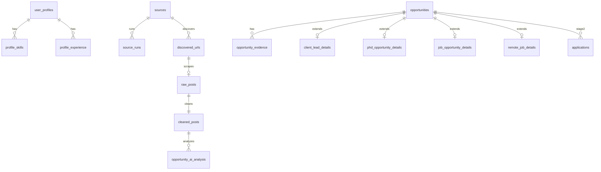

# Database Schema — Stage 1 Core

**Migration file:** `supabase/migrations/20260525100000_stage1_core_schema.sql`  
**Engine:** PostgreSQL (Supabase) with `uuid-ossp` and `vector` extensions  
**Primary keys:** UUID v4 via `uuid_generate_v4()`

This document explains **table groups 1–8**, key fields, indexes, and relationships. Apply the migration via Supabase SQL editor or CLI before running seed/scrape scripts.

---

## 1. Entity relationship overview



---

## 2. Table group 1 — Profile

**Purpose:** Canonical identity and matching context for Tapuwa Phill Mhembere.

| Table | Purpose |
|-------|---------|
| `user_profiles` | Root profile row |
| `profile_skills` | Skill tags with `priority_weight` |
| `profile_experience` | Work history |
| `profile_education` | Degrees and institutions |
| `profile_preferences` | Key-value JSON preferences (unique per key) |
| `profile_documents` | CV, letters — `content_text` or `storage_path` |
| `profile_knowledge_chunks` | RAG chunks + optional `embedding vector(384)` |

### 2.1 Key fields — `user_profiles`

| Column | Type | Notes |
|--------|------|-------|
| `display_name` | TEXT NOT NULL | UI name |
| `legal_name` | TEXT | Official name |
| `headline` | TEXT | Short positioning line |
| `location_country` | TEXT | Default `Germany` |
| `location_city` | TEXT | Default `Bremen` |
| `languages` | JSONB | e.g. `[{"code":"en","level":"native"}]` |
| `metadata` | JSONB | Extensibility |

### 2.2 Key fields — `profile_preferences`

| Column | Notes |
|--------|-------|
| `preference_key` | e.g. `avoid_self_funded_phd`, `preferred_remote` |
| `preference_value` | JSONB structured value |
| UNIQUE (`profile_id`, `preference_key`) | One row per key |

### 2.3 Indexes (profile group)

No dedicated hot-path indexes beyond PK/FK — low row count single user. Add GIN on `profile_knowledge_chunks.metadata` if filtering by `chunk_type`.

---

## 3. Table group 2 — Sources

**Purpose:** Curated origins, health, and search configuration.

| Table | Purpose |
|-------|---------|
| `source_categories` | Named categories (reference) |
| `sources` | Main catalog from seed JSON |
| `source_search_terms` | Optional normalized terms per source |
| `source_runs` | Per-run metrics |
| `source_health_metrics` | Daily rollups |
| `source_failures` | URL-level errors |

### 3.1 Key fields — `sources`

| Column | Notes |
|--------|-------|
| `external_id` | UNIQUE — maps seed JSON `id` |
| `url` / `base_domain` | Entry point |
| `target_section` | `client_lead`, `phd`, `job`, `remote_job` |
| `scraping_method_preference` | Router preference |
| `priority` | 1–10 throttle |
| `enabled` | Kill switch |
| `requires_login` | Must stay false for ethical scrape |
| `search_terms` | JSONB array cache |
| `health_score` | 0–100 rolling quality |

### 3.2 Indexes

| Index | Columns |
|-------|---------|
| `idx_sources_target_section` | `target_section` |
| `idx_sources_enabled` | `enabled` |

---

## 4. Table group 3 — Scraping

**Purpose:** Raw ingestion audit trail from discovery through cleaning.

| Table | Purpose |
|-------|---------|
| `scrape_jobs` | Batch/job tracking |
| `discovered_urls` | URL queue (Tavily, search, manual) |
| `raw_posts` | Immutable scraper output |
| `cleaned_posts` | Normalized text + hashes |
| `scraping_errors` | Fatal errors with stack |

### 4.1 Key fields — `discovered_urls`

| Column | Notes |
|--------|-------|
| `url_hash` | UNIQUE — SHA256 URL |
| `discovery_method` | `tavily_search`, `source_search`, `manual_dashboard` |
| `status` | `pending`, `scraped`, `failed`, `skipped` |
| `search_term` | Provenance for analytics |

### 4.2 Key fields — `cleaned_posts`

| Column | Notes |
|--------|-------|
| `content_hash` | UNIQUE per content — AI cache key |
| `quality_score` | 0–100 from gate |
| `quality_status` | `passed`, `failed`, `manual_review`, `needs_rescrape` |
| `rejection_reason` | If failed |

### 4.3 Indexes

| Index | Columns |
|-------|---------|
| `idx_discovered_urls_status` | `status` |
| `idx_cleaned_posts_content_hash` | `content_hash` |

---

## 5. Table group 4 — Opportunities (core)

**Purpose:** Unified opportunity entity across all dashboard sections.

| Table | Purpose |
|-------|---------|
| `opportunities` | Master record |
| `opportunity_sources` | Multi-source provenance |
| `opportunity_contacts` | Extracted contacts with proof |
| `opportunity_evidence` | Snippet evidence |
| `opportunity_scores` | Score breakdown history |
| `opportunity_ai_analysis` | Per-model outputs |
| `opportunity_votes` | Voting rounds |
| `opportunity_status_history` | Audit trail |
| `opportunity_user_actions` | save/reject/note |
| `opportunity_duplicates` | Merge graph |
| `opportunity_tags` | Labels |
| `opportunity_notes` | Free text |

### 5.1 Key fields — `opportunities`

| Column | Notes |
|--------|-------|
| `category` | Section routing |
| `status` | Lifecycle — see product plan |
| `viewed` | **Preserved on dedup merge** |
| `final_score` / `confidence_score` | 0–100 |
| `url_hash` | UNIQUE dedup |
| `content_hash` / `semantic_hash` | Dedup layers |
| `approved_for_application` | User flag |
| `stage2_ready` | Gate for Stage 2 UI |
| `times_seen` | Increment on re-scrape |

### 5.2 Key fields — `opportunity_evidence`

| Column | Notes |
|--------|-------|
| `evidence_type` | funding_proof, remote_proof, etc. |
| `snippet` | Verbatim quote |
| `model_name` | Source model |

### 5.3 Indexes (hot paths)

| Index | Columns | Query pattern |
|-------|---------|---------------|
| `idx_opportunities_category` | `category` | Section tabs |
| `idx_opportunities_subcategory` | `subcategory` | Filters |
| `idx_opportunities_country` | `country` | Geo tabs |
| `idx_opportunities_city` | `city` | Bremen local |
| `idx_opportunities_status` | `status` | Review queue |
| `idx_opportunities_viewed` | `viewed` | Unread |
| `idx_opportunities_posted_date` | `posted_date` | Recency |
| `idx_opportunities_deadline` | `deadline` | Urgency |
| `idx_opportunities_final_score` | `final_score DESC` | Sort |
| `idx_opportunities_url_hash` | `url_hash` | Dedup lookup |
| `idx_opportunities_content_hash` | `content_hash` | Near-dup |

---

## 6. Table group 5 — Category-specific details

**Purpose:** 1:1 extension tables keyed by `opportunity_id`.

| Table | Section |
|-------|---------|
| `client_lead_details` | Client Leads |
| `phd_opportunity_details` | PhD |
| `job_opportunity_details` | Jobs |
| `remote_job_details` | Remote |

### 6.1 `client_lead_details`

| Column | Notes |
|--------|-------|
| `client_type` | business, nonprofit, individual |
| `need_detected` | Parsed need string |
| `technical_service_category` | web, automation, etc. |
| `lead_region` | Germany, South Africa, Global |
| `south_africa_focus` | BOOLEAN boost |

### 6.2 `phd_opportunity_details`

| Column | Notes |
|--------|-------|
| `funding_status` | fully_funded, unclear, self_funded, … |
| `funding_proof` | Snippet or citation |
| `email_application_possible` | yes/no/unclear |
| `application_email` | Extracted address |
| `why_fits_profile` | AI narrative |

### 6.3 `job_opportunity_details`

| Column | Notes |
|--------|-------|
| `skills_required` | JSONB array |
| `language_requirements` | JSONB — German level detection |
| `work_mode` | onsite, hybrid, remote |
| `email_application_possible` | Preferred apply path |

### 6.4 `remote_job_details`

| Column | Notes |
|--------|-------|
| `remote_restriction` | worldwide_remote, us_only_remote, … |
| `remote_proof` | Required snippet backing |
| `timezone_restriction` | e.g. CET±2 |
| `company_location` | For restriction inference |

---

## 7. Table group 6 — RAG / vector

| Table | Purpose |
|-------|---------|
| `opportunity_knowledge_chunks` | Chunked opportunity text + `embedding` |
| `embeddings_metadata` | Track model and backend |
| `rag_queries` | Query audit |
| `rag_results` | Retrieved chunks per query |

### 7.1 Vector column

```sql
embedding vector(384)
```

Align embedding model output to 384 dimensions before insert.

---

## 8. Table group 7 — Documents / Stage 2-ready

**Purpose:** Schema present in Stage 1; **workflows inactive** until Stage 2.

| Table | Stage 1 use |
|-------|-------------|
| `document_vault` | Store CV metadata optional |
| `document_versions` | Version history |
| `document_bundles` / `document_bundle_items` | Application packages |
| `applications` | Empty — linked when applying |
| `application_documents` | Junction |
| `email_drafts` | Not generated |
| `gmail_threads` | Not connected |
| `portal_application_tasks` | Checklists for portals |
| `follow_up_tasks` | Reminders |
| `application_events` | Timeline |

### 8.1 Bridge fields on `opportunities`

| Column | Links to |
|--------|----------|
| `recommended_document_bundle` | `document_bundles.id` |
| `required_documents` | JSONB checklist |
| `application_url` | External apply link |
| `application_status` | draft/submitted — Stage 2 |

---

## 9. Table group 8 — System

| Table | Purpose |
|-------|---------|
| `audit_logs` | Security and admin actions |
| `ai_model_runs` | Per inference metrics |
| `api_usage_logs` | Quota and cost |
| `system_settings` | Key-value config |
| `notification_logs` | Future alerts |
| `backup_exports` | Export job registry |

### 9.1 `system_settings` examples

| key | value |
|-----|-------|
| `ai_daily_cloud_calls` | `{"limit":200,"used":0,"date":"2026-05-25"}` |
| `scraper_schedule` | `{"cron":"0 7 * * *"}` |

---

## 10. Row Level Security

Enabled on:

- `opportunities`
- `sources`
- `user_profiles`

Policy pattern: `authenticated` role **full access** (single-user private app).

**Backend scripts:** Use service role (`SUPABASE_SECRET_KEY`) — bypasses RLS.

---

## 11. Uniqueness and idempotency

| Constraint | Prevents |
|------------|----------|
| `sources.external_id` UNIQUE | Duplicate seeds |
| `discovered_urls.url_hash` UNIQUE | Duplicate queue |
| `opportunities.url_hash` UNIQUE | Duplicate opportunities |
| `cleaned_posts.content_hash` (indexed) | Re-analysis |
| `opportunity_tags (opportunity_id, tag)` | Duplicate tags |
| `source_health_metrics (source_id, metric_date)` | Duplicate daily metrics |

---

## 12. Typical query patterns (frontend)

| Page | SQL filter (conceptual) |
|------|-------------------------|
| Client Leads DE | `category='client_lead' AND country='Germany'` |
| PhD funded | join `phd_opportunity_details` where funding in funded set |
| Jobs high | `category='job' AND final_score >= 80` |
| Remote worldwide | join `remote_job_details` where `remote_restriction='worldwide_remote'` |
| Review queue | `status='manual_review'` |
| Unviewed | `viewed=false ORDER BY final_score DESC` |

Use Supabase client `.from('opportunities').select('*, phd_opportunity_details(*)')` style joins.

---

## 13. Migration application

```bash
# Supabase CLI (if linked)
supabase db push

# Or paste SQL in Dashboard → SQL Editor
```

Verify:

```sql
SELECT count(*) FROM information_schema.tables
WHERE table_schema = 'public' AND table_name = 'opportunities';
```

---

## 14. Future migrations (not in Stage 1 file)

| Change | Reason |
|--------|--------|
| IVFFlat/HNSW indexes on embeddings | Performance at scale |
| Partial indexes on `status='new'` | Faster inbox |
| `tsvector` on `cleaned_posts.body_text` | Keyword fallback search |

---

## 15. Related documentation

| File | Topic |
|------|-------|
| `stage-1-product-plan.md` | Status enums and scoring |
| `rag-strategy.md` | Vector usage |
| `stage-2-future-connection.md` | Group 7 activation |
