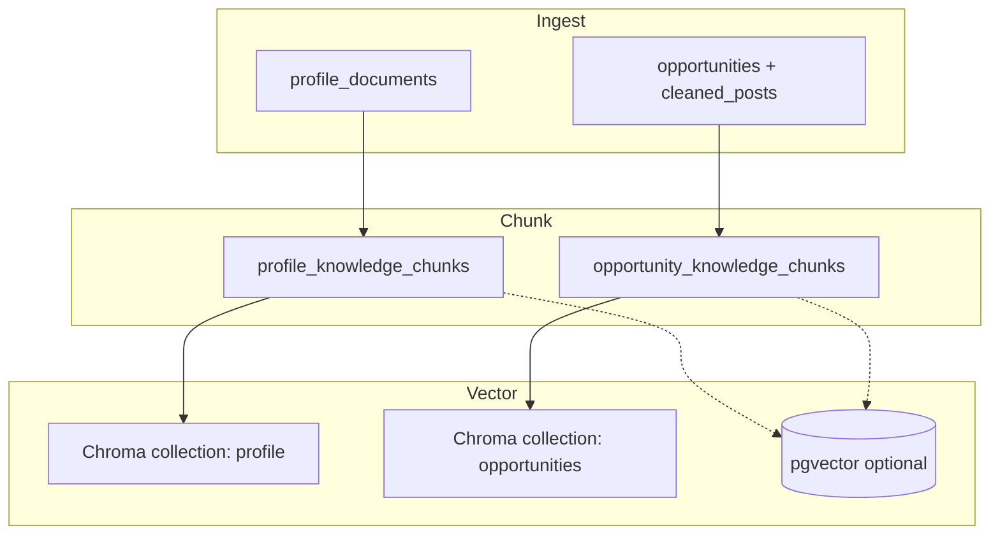

# RAG Strategy — Profile and Opportunity Retrieval

**Stage 1 approach:** **Chroma first** (local persistent store), **pgvector later** (Supabase `vector` columns already in schema).  
**Embedding model:** 384-dimensional vectors (aligned with `vector(384)` in migration).

---

## 1. Objectives

| Objective | How RAG helps |
|-----------|---------------|
| Personalize classification | Inject relevant CV bullets into classifier prompt |
| Explain fit | Surface “why similar to past wins” snippets |
| Reduce tokens | Retrieve top-k chunks instead of full CV |
| Future Stage 2 | Ground cover letter generation in profile + opportunity |

Stage 1 does **not** require RAG for basic pipeline operation — rule-based profile strings suffice — but indexing runs after opportunity upsert for quality.

---

## 2. Two RAG domains

| Domain | Collection name | Source entities | Query use |
|--------|-----------------|-----------------|-----------|
| **Profile RAG** | `profile` | `profile_documents`, skills, experience → `profile_knowledge_chunks` | Classifier prompt, scoring explanations |
| **Opportunity RAG** | `opportunities` | Opportunity title + body chunks | Dedup semantic, similarity search in UI |



---

## 3. Chroma first (Stage 1 production)

**Module:** `backend/app/rag/chroma_store.py`

| Setting | Default |
|---------|---------|
| `CHROMA_PERSIST_DIR` | `./data/chroma` |
| Client | `chromadb.PersistentClient` |
| API | `upsert`, `query` |

### 3.1 Why Chroma first

| Reason | Detail |
|--------|--------|
| Zero extra Supabase cost | Vectors stay on disk in Actions artifact or local dev |
| Fast iteration | Reindex without migration |
| Gitignored data | `data/chroma/` not committed |
| Simple Python API | Matches batch scripts |

### 3.2 Collection design

| Collection | Document ID format | Metadata |
|------------|-------------------|----------|
| `profile` | `profile_{chunk_id}` | `profile_id`, `chunk_type`, `skill_name` |
| `opportunities` | `opp_{opportunity_id}_{chunk_index}` | `category`, `status`, `final_score` |

### 3.3 Chunking rules

| Source | Chunk size | Overlap |
|--------|------------|---------|
| CV / cover letter | ~500 tokens | 50 tokens |
| Opportunity body | ~400 tokens | 40 tokens |
| Short posts | Single chunk if &lt; 400 tokens |

Store chunk text in Postgres **and** Chroma for rebuild:

- Profile: `profile_knowledge_chunks.content`
- Opportunity: `opportunity_knowledge_chunks.content`

### 3.4 Embedding generation

Use `sentence-transformers` (in `requirements.txt`) with a 384-dim model, e.g.:

- `all-MiniLM-L6-v2` (384 dimensions) — matches schema

Pipeline step (rag-index job):

1. Load text batch.
2. Encode to vector.
3. `ChromaStore.upsert(ids, documents, metadatas)`.
4. Insert `embeddings_metadata` row (`storage_backend = chroma`).

---

## 4. pgvector later (Stage 1.5+)

Migration already enables:

```sql
CREATE EXTENSION IF NOT EXISTS vector;
-- profile_knowledge_chunks.embedding vector(384)
-- opportunity_knowledge_chunks.embedding vector(384)
```

### 4.1 Dual-write strategy

| Phase | Behavior |
|-------|----------|
| **1** | Chroma only |
| **2** | Chroma + Postgres copy on upsert |
| **3** | Query Postgres hybrid; Chroma as rebuild cache |

### 4.2 Why add pgvector

| Benefit | Use case |
|---------|----------|
| Single datastore | Frontend Edge Functions query Supabase only |
| RLS | Vectors protected same as opportunities |
| Backups | Included in Supabase backup exports |
| SQL filters | `category = phd` + vector similarity |

### 4.3 Index recommendation (when enabling)

```sql
CREATE INDEX ON opportunity_knowledge_chunks
  USING ivfflat (embedding vector_cosine_ops) WITH (lists = 100);
```

Tune `lists` after row count &gt; 10k.

---

## 5. Query patterns

### 5.1 Profile RAG (classification)

```python
store = ChromaStore("profile")
hits = store.query(cleaned_post_title + " " + cleaned_post_body[:500], n=5)
context = "\n".join(hits["documents"][0])
```

Inject into `ClassifierBrain` prompt after static profile summary.

### 5.2 Opportunity RAG (dashboard)

| UI feature | Query |
|------------|-------|
| “Similar opportunities” | Query `opportunities` collection with current opp embedding |
| Review queue clustering | Near-duplicate semantic pairs |

Pair with `semantic_deduper.py` — embedding cosine &gt; threshold → merge candidate.

### 5.3 Logging retrieval

`rag_queries` + `rag_results` tables store:

- Query text and type (`profile_match`, `similar_opportunity`)
- Retrieved chunk IDs and scores
- Enables debugging bad classifications

---

## 6. Reindex and rebuild

| Event | Action |
|-------|--------|
| New opportunity | Upsert chunks + Chroma |
| Profile document edit | Delete collection IDs for profile; re-chunk |
| Model dimension change | Bump `embeddings_metadata.model_name`; full reindex |
| Chroma corruption | Rebuild from Postgres text columns |

**Script (planned):** `scripts/run_rag_indexing.py` triggered by `rag-indexing.yml` after AI analysis.

---

## 7. GitHub Actions and persistence

| Environment | Chroma path |
|-------------|-------------|
| Local dev | `./data/chroma` |
| CI | Ephemeral unless uploaded as artifact |

**Recommendation for CI:** 

- Option A: Reindex each AI run (CPU cost, simple).
- Option B: Upload/download `data/chroma` cache artifact (faster queries).

Production long-term: migrate vectors to pgvector to avoid artifact drift.

---

## 8. Metadata and governance

`embeddings_metadata` tracks:

| Column | Purpose |
|--------|---------|
| `entity_type` | `profile_chunk`, `opportunity_chunk` |
| `entity_id` | UUID FK |
| `model_name` | e.g. `all-MiniLM-L6-v2` |
| `dimensions` | 384 |
| `storage_backend` | `chroma` → `pgvector` |

Do not embed secrets or API keys in chunk text.

---

## 9. Performance targets

| Operation | Target |
|-----------|--------|
| Embed 100 chunks | &lt; 60s CPU |
| Query top-5 | &lt; 200ms local |
| Full reindex all opportunities | &lt; 10 min nightly |

---

## 10. Failure modes

| Issue | Mitigation |
|-------|------------|
| Chroma path missing | `mkdir -p` in store init |
| Dimension mismatch | Validate before upsert |
| Empty collection query | Fall back to static profile only |
| HF model download fail | Pin model cache in CI |

---

## 11. Stage 2 RAG extensions (planned)

| Feature | RAG role |
|---------|----------|
| Cover letter draft | Profile + opportunity chunks |
| Email reply | Thread context + profile tone |
| Document vault | Version-aware chunking |

Tables ready: `document_vault`, `email_drafts` — see `stage-2-future-connection.md`.

---

## 12. Related documentation

| File | Topic |
|------|-------|
| `ai-brain-rules.md` | Prompt injection |
| `database-schema.md` | Vector columns |
| `stage-1-architecture.md` | Data flow step 10 |
