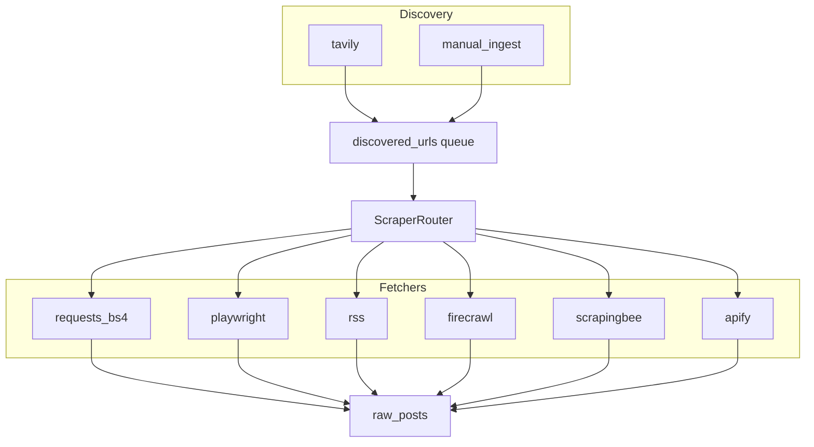
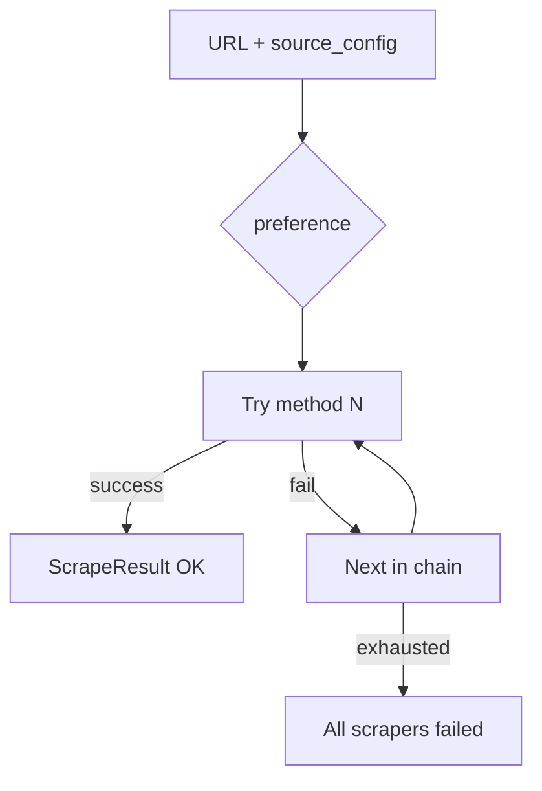

# Scraping Strategy — Eight Streams, Router, and Ethics

**Scope:** Stage 1 ingestion from public web sources into `raw_posts` / `cleaned_posts`.  
**Out of scope:** Authenticated portals, CAPTCHA solving, credential stuffing.

---

## 1. The eight scraper streams

Stage 1 defines **eight ingestion streams**. Six are page fetchers, one is discovery-only, one is human-triggered.

| # | Stream ID | Class / module | Role |
|---|-----------|----------------|------|
| 1 | `requests_bs4` | `RequestsBs4Scraper` | Default: static HTML via HTTP + BeautifulSoup |
| 2 | `playwright` | `PlaywrightScraper` | Headless browser for JS-rendered listings |
| 3 | `rss` | `RssScraper` | Atom/RSS feeds (universities, job boards) |
| 4 | `firecrawl` | `FirecrawlScraper` | Managed crawl/extract API for complex sites |
| 5 | `scrapingbee` | `ScrapingBeeScraper` | Proxy + render service for bot-blocked pages |
| 6 | `apify` | `ApifyScraper` | Actor-based extraction for structured portals |
| 7 | `tavily` | `TavilyDiscovery` | **Discovery only** — writes `discovered_urls`, not opportunities |
| 8 | `manual_ingest` | Dashboard → scrape job | User-supplied URL high-priority queue |



---

## 2. Scraper router and fallback

**Module:** `backend/app/scraping/scraper_router.py`

### 2.1 Selection algorithm

1. Read `scraping_method_preference` from source config (default `requests_bs4`).
2. Build chain: `[preference] + DEFAULT_FALLBACK_CHAIN \ {preference}`.
3. `DEFAULT_FALLBACK_CHAIN = [requests_bs4, firecrawl, playwright, scrapingbee]`.
4. For each method in chain:
   - Apply `rate_limit(source)`.
   - Call `scrape_url()` → `normalize_result()`.
   - Return first `success=True`.
5. If all fail, return last error; log to `source_failures` / `scraping_errors`.

### 2.2 Why this order

| Position | Rationale |
|----------|-----------|
| `requests_bs4` first | Cheapest, fastest, lowest ToS surface for static classifieds |
| `firecrawl` second | Good markdown extraction without local browser ops in CI |
| `playwright` third | Heavy but handles SPAs when API keys exhausted |
| `scrapingbee` last paid fallback | Costs per request; use when blocked |

`apify` and `rss` are **not** in the default chain — invoked when set as explicit preference (e.g. RSS feed URL, Apify actor for a portal).

### 2.3 Router diagram



---

## 3. Per-stream implementation notes

### 3.1 `requests_bs4`

| Aspect | Detail |
|--------|--------|
| User-Agent | `OpportunityCommandCenter/1.0 (+https://github.com/TapsyPhill/phill-application-copilot)` |
| Timeout | 30s |
| HTML cleanup | Strip `script`, `style`, `nav`, `footer`, `header` |
| Output | `title`, `text`, `html`, up to 200 links |
| Best for | German classifieds, simple job posts |

### 3.2 `playwright`

| Aspect | Detail |
|--------|--------|
| Use when | `requires_js: true` on source |
| CI note | Install browsers in workflow or use container with playwright deps |
| Cost | CPU/time — limit concurrent pages |

### 3.3 `rss`

| Aspect | Detail |
|--------|--------|
| Use when | `source_type` includes feed URL |
| Library | `feedparser` |
| Output | One `ScrapeResult` per entry; map `link` to `source_url` |

### 3.4 `firecrawl`

| Aspect | Detail |
|--------|--------|
| API key | `FIRECRAWL_API_KEY` |
| Use when | Complex DOM, markdown desired |
| Log usage | `api_usage_logs` service_name `firecrawl` |

### 3.5 `scrapingbee`

| Aspect | Detail |
|--------|--------|
| API key | `SCRAPINGBEE_API_KEY` |
| Use when | 403 on direct requests, geo blocks |
| Ethical use | Last resort, not default |

### 3.6 `apify`

| Aspect | Detail |
|--------|--------|
| API token | `APIFY_API_TOKEN` |
| Use when | Portal needs maintained actor (e.g. large job board) |
| Store | `scraper_used = apify` on `raw_posts` |

### 3.7 `tavily` (discovery stream)

| Aspect | Detail |
|--------|--------|
| Never writes | `raw_posts` directly from search hit |
| Output | `DiscoveredLink` → `discovered_urls` |
| Max results | Default 10 per query (tunable) |
| Dedup | `url_hash` set per link |

### 3.8 `manual_ingest`

| Aspect | Detail |
|--------|--------|
| Trigger | Settings UI |
| Priority | Front of scrape queue same day |
| Audit | `discovery_method = manual_dashboard` |

---

## 4. Rate limits and throttling

**Base implementation:** `BaseScraper.rate_limit()` in `base_scraper.py`.

| Input | Effect |
|-------|--------|
| `priority` 1–10 | Higher priority → shorter delay |
| Formula | `delay = max(0.5, rate_limit_seconds * (11 - min(priority, 10)) / 5)` |
| Default `rate_limit_seconds` | 1.0s between requests per scraper instance |

### 4.1 Recommended operational caps

| Cap | Value | Why |
|-----|-------|-----|
| Requests per domain per hour | 60 | Avoid IP ban |
| Concurrent Playwright pages | 2 in CI | Memory |
| Tavily queries per daily run | ≤ 30 | API cost |
| Apify actor runs per day | Budget-based | Token cost |

### 4.2 Source-level spacing

Group `germany_local_group*` sources with staggered start times in `run_daily_scrape.py` (implementation TODO): e.g. +30s between groups.

---

## 5. Normalized scrape result

All streams return `ScrapeResult`:

| Field | Persisted to |
|-------|--------------|
| `source_url` | `raw_posts.source_url` |
| `title`, `text`, `markdown`, `html` | `raw_posts` columns |
| `scraper_name` | `raw_posts.scraper_used` |
| `metadata` | JSONB diagnostics |
| `success` / `error` | drives retry / `discovered_urls.status` |

`normalize_result()` collapses whitespace in `text` for consistent hashing.

---

## 6. Cleaning pipeline (post-scrape)

| Step | Component |
|------|-----------|
| Strip boilerplate | Cleaning script (extensible) |
| Language detect | `cleaned_posts.language` |
| `content_hash` | SHA256 of normalized body for dedup + AI cache |
| Quality gate | `DataQualityGate.evaluate()` |

| quality_status | Next step |
|----------------|-----------|
| `passed` | AI queue |
| `failed` | Stop; log reason |
| `manual_review` | Review queue, no auto-reject |
| `needs_rescrape` | Re-enqueue with next scraper in chain |

---

## 7. Ethical and legal rules

| Rule | Enforcement |
|------|-------------|
| **Public data only** | `requires_login` sources must stay `enabled=false` |
| **No CAPTCHA bypass** | `manual_review` when captcha detected in body |
| **No credential use** | No passwords in env for scraping |
| **Identify bot** | Custom User-Agent with project URL |
| **Respect rate limits** | `rate_limit()` + domain caps |
| **No personal data harvesting** | Only fields needed for opportunity evaluation |
| **Robots.txt** | Future: check before scrape; default cautious on unknown domains |
| **Right to erasure** | User can `reject` + archive; audit in `audit_logs` |

### 7.1 Blocked page handling

| Detection | Action |
|-----------|--------|
| `403` / `access denied` | `needs_rescrape` + fallback scraper |
| `captcha` / `login required` | `manual_review`, do not retry aggressively |
| Empty body | `failed` |

---

## 8. Error logging

| Table | Content |
|-------|---------|
| `scraping_errors` | Stack traces, job linkage |
| `source_failures` | Per-URL failure with `scraper_used` |
| `source_runs` | Aggregate counts per daily run |

---

## 9. GitHub Actions integration

`daily-scrape.yml` provides:

- `FIRECRAWL_API_KEY`, `SCRAPINGBEE_API_KEY`, `APIFY_API_TOKEN`, `TAVILY_API_KEY`
- `SUPABASE_URL`, `SUPABASE_SECRET_KEY`

Playwright in CI requires explicit install step when enabled:

```yaml
- run: playwright install chromium
```

(Add when Playwright stream used in production cron.)

---

## 10. Testing scrapers locally

```bash
python -c "
from backend.app.scraping.scraper_router import ScraperRouter
r = ScraperRouter()
print(r.scrape('https://example.com', {'scraping_method_preference': 'requests_bs4'}))
"
```

Always test one URL per new seed before bulk cron.

---

## 11. Failure modes and responses

| Failure | System response |
|---------|-----------------|
| All scrapers fail | `discovered_urls.status=failed`; no opportunity |
| Intermittent 5xx | Tenacity retry at HTTP layer (future) |
| Changed DOM | Drop `health_score`; switch preference to `firecrawl` |
| API quota exceeded | Skip paid streams; log `api_usage_logs` |

---

## 12. Related documentation

| File | Topic |
|------|-------|
| `source-strategy.md` | Where URLs originate |
| `ai-brain-rules.md` | Post-cleaning intelligence |
| `loopholes-and-safeguards.md` | Scraping abuse risks |
