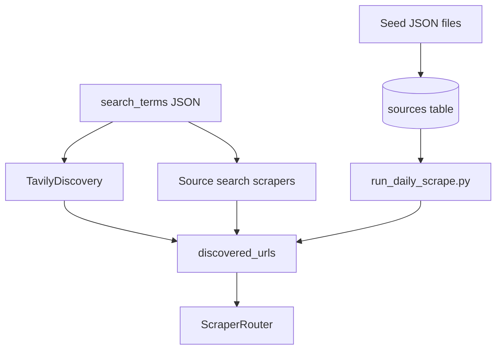
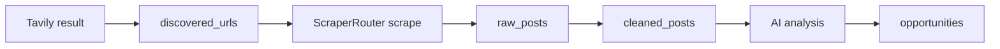

# Source Strategy — Seeds, Search Terms, and Discovery

**Goal:** Maximize *relevant* opportunity URLs for Tapuwa Phill Mhembere while minimizing noise, duplicate domains, and AI cost on garbage pages.

**Core rule:** Curated **seed sources** are the primary trust anchor. **Tavily** expands discovery but never creates opportunities without a successful scrape of the target page.

---

## 1. Strategy overview

| Layer | Mechanism | Output table |
|-------|-----------|--------------|
| **Seed catalogs** | Static JSON → `scripts/seed_sources.py` | `sources` |
| **Search terms** | JSON term lists per section/language | `source_search_terms`, `sources.search_terms` |
| **On-site search** | Sources with `allows_search: true` | URLs via scraper `search_source()` |
| **Tavily discovery** | Web search API | `discovered_urls` only |
| **Manual ingest** | Dashboard URL form | `discovered_urls` + priority scrape |



---

## 2. Seed source files

| File | `target_section` | Geographic focus |
|------|------------------|------------------|
| `germany_local_client_sources.json` | `client_lead` | Bremen, Lower Saxony, Niedersachsen classifieds |
| `global_client_sources.json` | `client_lead` | International freelance / forum platforms |
| `south_africa_client_sources.json` | `client_lead` | SA business directories and boards |
| `phd_sources.json` | `phd` | EURAXESS, DAAD, Academic Positions, university feeds |
| `job_sources.json` | `job` | StepStone, LinkedIn public, Indeed DE, etc. |
| `remote_job_sources.json` | `remote_job` | We Work Remotely, Remotive, Arbeitnow API |

### 2.1 Seed record schema (JSON)

Each source object maps to `sources` columns:

| Field | Purpose |
|-------|---------|
| `id` | Stable `external_id` for upsert |
| `source_name` | Human label |
| `url` / `base_domain` | Canonical entry point |
| `source_group` | UI grouping (e.g. `germany_local_group1`) |
| `country`, `region`, `city` | Filters for Client Leads tabs |
| `language` | `de`, `en`, `af` — drives term file selection |
| `source_type` | `classified`, `phd_portal`, `job_board`, `remote_job_board` |
| `scraping_method_preference` | Router first choice |
| `priority` | 1–10; affects rate limit delay |
| `enabled` | Soft kill switch |
| `requires_js` / `requires_login` | Router hints; login sources disabled |
| `allows_search` | Enable on-site search crawl |
| `search_url_pattern` | Optional template for query URLs |
| `health_score` | Rolling quality; decay on failures |

### 2.2 Seeding command

```bash
python scripts/seed_sources.py
```

Requires `SUPABASE_URL` + `SUPABASE_SECRET_KEY`. Upserts on `external_id` — safe to re-run daily before scrape.

---

## 3. Search term files

| File | Language | Section |
|------|----------|---------|
| `client_leads_de.json` | German | Client leads (local) |
| `client_leads_en.json` | English | Client leads (global) |
| `client_leads_south_africa.json` | English/Afrikaans mix | SA client leads |
| `phd_terms.json` | English | PhD |
| `job_terms.json` | English | Jobs |
| `remote_job_terms.json` | English | Remote |

Terms are **short natural phrases** mirroring how real posts are written, not boolean keyword soup.

### 3.1 Example term categories

| Section | Term intent |
|---------|-------------|
| Client DE | “Webseite Hilfe”, “IT Unterstützung Verein”, “Excel Hilfe” |
| Client EN | “website help needed”, “small business automation” |
| PhD | “fully funded PhD data science”, “doctoral researcher machine learning Germany” |
| Job | “Data Scientist Germany Python”, “LLM Engineer job Europe” |
| Remote | “worldwide remote data scientist”, “Africa friendly remote data science” |

### 3.2 Term rotation (recommended ops)

| Rule | Rationale |
|------|-----------|
| Max 5 Tavily queries per section per day | Cost control |
| Rotate terms weekly | Avoid stale SERP overlap |
| Log `search_term` on `discovered_urls` | Measure which terms convert |

---

## 4. Germany local sources strategy

Phill is based in **Bremen**. Local client leads are the highest-trust, lowest-competition channel.

### 4.1 Geographic tiers

| Tier | Regions | Source examples (from seeds) |
|------|---------|------------------------------|
| **Tier A** | Bremen city | `schwarzesbrett.bremen.de`, Weser-Kurier Anzeigen |
| **Tier B** | Lower Saxony adjacent | Verden, Delmenhorst, Oldenburg marketplaces |
| **Tier C** | Niedersachsen wider | Hannover-area boards where Bremen commutable |

### 4.2 Source group naming

`source_group` values like `germany_local_group1` … `groupN` batch sources for:

- Parallel scrape throttling per group.
- Health metrics without overloading one domain.
- UI tab “Germany local” filter.

### 4.3 Language and scraping

| Setting | Value |
|---------|-------|
| `language` | `de` |
| `scraping_method_preference` | `requests_bs4` first (most classifieds are static) |
| Fallback | `firecrawl` if layout complex |
| Terms file | `client_leads_de.json` |

### 4.4 Why local classifieds first

| Benefit | Explanation |
|---------|-------------|
| Less SEO spam | Community boards vs. aggregated job spam |
| Phone/email common | Boosts `contact_score` |
| German micro-business fit | Matches freelance IT support positioning |
| Geographic scoring | `country_score` 85 for Germany matches |

### 4.5 Operational cautions

| Risk | Mitigation |
|------|------------|
| Terms of service | Public listings only; respect robots; slow rate limit |
| Stale ads | `last_seen_at` bump on re-scrape; archive old |
| Wrong category (housing/for-sale) | AI `client_need_type` + manual reject |

---

## 5. Global and South Africa client sources

| Market | Seed file | When to prefer |
|--------|-----------|----------------|
| Global | `global_client_sources.json` | Platform messages, Upwork-style, dev forums |
| South Africa | `south_africa_client_sources.json` | `south_africa_focus` leads, diaspora network |

Scoring boosts SA rows via `south_africa_focus` and `country_score` rules in `ScoringRules.score_client_lead`.

---

## 6. PhD, job, and remote seed strategy

| Section | Seed priority | Key fields to extract |
|---------|---------------|----------------------|
| PhD | Portals with structured listings | funding, deadline, supervisor, email |
| Job | Boards with skill text | skills_required, language_requirements |
| Remote | Boards with remote metadata | `remote_restriction`, timezone, company location |

**PhD funding rule:** Seeds do not imply funding — AI must extract `funding_proof` from page text.

**Remote rule:** Seed site advertising “remote” is insufficient; listing body must supply `remote_proof`.

---

## 7. Tavily verification rule

> **Tavily discovers candidates; the scraped source page is the only truth for classification and scoring.**

### 7.1 Allowed Tavily outcomes

| Outcome | Allowed |
|---------|---------|
| Insert `discovered_urls` with `discovery_method = tavily_search` | ✅ |
| Store title/snippet in `metadata` for human debug | ✅ |
| Create `opportunities` row from snippet alone | ❌ |
| Set `funding_status` from Tavily summary | ❌ |

### 7.2 Pipeline enforcement



If scrape fails after Tavily discovery:

1. Mark `discovered_urls.status = failed`.
2. Log `source_failures`.
3. Optionally retry with fallback scraper chain.
4. **Do not** promote to opportunity.

### 7.3 Deduplication with Tavily

`url_hash = SHA256(normalized_url)` prevents the same Tavily hit from enqueueing twice.

### 7.4 Query construction

Combine:

- Term from JSON file.
- Optional geo hint: `"Bremen"` for DE client terms.
- Negative site operators in future: `-site:linkedin.com` if noise high.

Implementation: `TavilyDiscovery.discover_for_terms()` in `tavily_discovery.py`.

---

## 8. Source health and lifecycle

| Metric | Table | Use |
|--------|-------|-----|
| Success rate | `source_health_metrics` | Disable chronic failures |
| Garbage rate | `source_health_metrics` | Lower `health_score` |
| Opportunities created | `source_health_metrics` | ROI per source |
| Per-run stats | `source_runs` | Daily scrape audit |

### 8.1 Auto-disable policy (recommended)

| Condition | Action |
|-----------|--------|
| 7-day success &lt; 30% | `enabled = false` |
| garbage_rate &gt; 60% | Lower priority, review notes |
| ToS block detected | Permanent disable + audit log |

---

## 9. Manual URL ingestion

| Field | Behavior |
|-------|----------|
| User pastes URL in Settings | Insert `discovered_urls` priority queue |
| `discovery_method` | `manual_dashboard` |
| Scrape | Immediate job, bypass daily batch delay |

Used for links Phill finds on social media — still requires full pipeline.

---

## 10. Source–section mapping

| `target_section` | Dashboard | Detail table |
|----------------|-----------|--------------|
| `client_lead` | Client Leads | `client_lead_details` |
| `phd` | PhD | `phd_opportunity_details` |
| `job` | Jobs | `job_opportunity_details` |
| `remote_job` | Remote | `remote_job_details` |

Classifier must set `category` aligned with `target_section` or route to `manual_review`.

---

## 11. Adding new sources (playbook)

1. Verify site allows public reading of listings (no paywall/login).
2. Add entry to appropriate `seed_sources/*.json` with unique `id`.
3. Set `scraping_method_preference` based on JS need.
4. Run `seed_sources.py`.
5. Dry-run scrape one URL via `ScraperRouter`.
6. Monitor `source_runs` for 3 days before enabling in production cron.

---

## 12. Anti-patterns

| Anti-pattern | Why |
|--------------|-----|
| Scraping LinkedIn logged-in feeds | ToS + account risk |
| Thousands of Tavily queries/day | Cost + duplicate SERP |
| Trusting aggregator snippets | Hallucinated funding/remote flags |
| Same URL two `external_id`s | Breaks dedup and health stats |

---

## 13. Related documentation

| Document | Topic |
|----------|-------|
| `scraping-strategy.md` | How URLs are fetched |
| `stage-1-product-plan.md` | Dashboard sections |
| `loopholes-and-safeguards.md` | Tavily and source risks |
