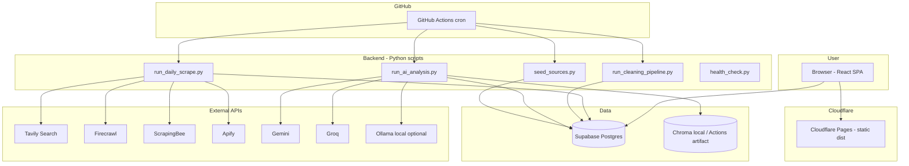
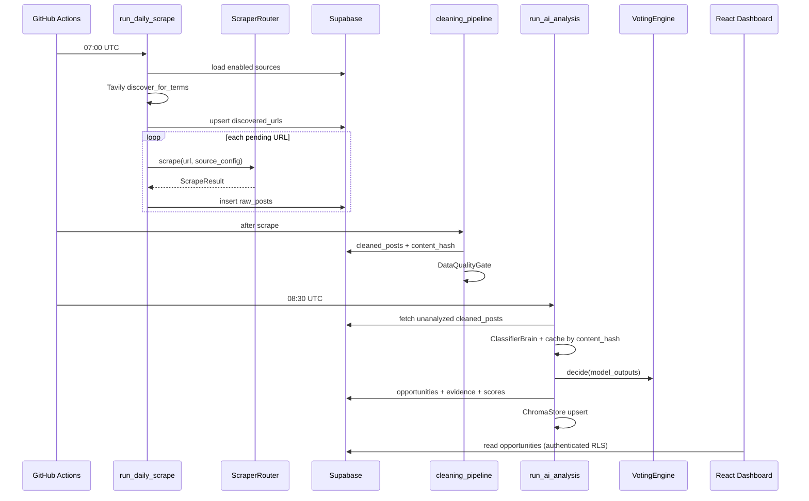
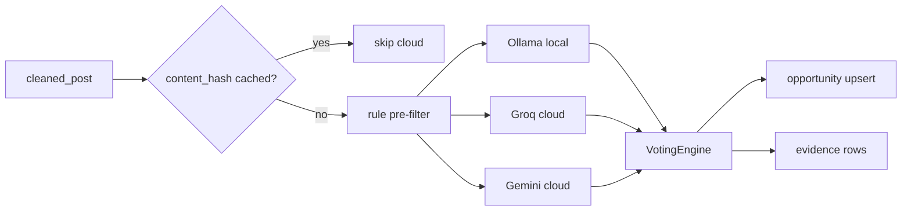
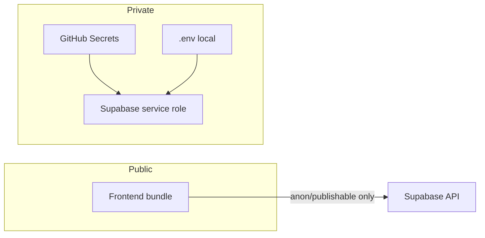

# Stage 1 Technical Architecture — Opportunity Command Center

**Repository:** `phill-job-application-copilot`  
**Runtime split:** Python backend (pipelines, AI, scraping) + React/Vite frontend (dashboard)  
**Data plane:** Supabase Postgres (source of truth) + local Chroma (embeddings) → pgvector later  
**Hosting:** Cloudflare Pages (frontend) + GitHub Actions (scheduled backend jobs)

---

## 1. Architecture principles

| Principle | Implementation |
|-----------|----------------|
| **Secrets never in frontend** | Only `VITE_*` publishable Supabase keys in build |
| **Source page is truth** | Tavily discovers URLs only; classification uses scraped body |
| **Idempotent ingestion** | `url_hash` / `content_hash` unique constraints |
| **User state preserved** | Dedup merge keeps `viewed`, notes, status |
| **Cost-aware AI** | Rule pre-filter, content-hash cache, daily cloud quota |
| **Ethical scraping** | Public pages, rate limits, identifiable User-Agent, no login bypass |

---

## 2. System context diagram



---

## 3. Component map

| Layer | Component | Path | Responsibility |
|-------|-----------|------|----------------|
| **Frontend** | React SPA | `frontend/src/` | Dashboard, Supabase client reads/writes |
| **Config** | Settings | `backend/app/config/settings.py` | Pydantic env loading |
| **Sources** | Seed JSON | `backend/app/sources/seed_sources/` | Curated domains |
| **Sources** | Search terms | `backend/app/sources/search_terms/` | Tavily + source search queries |
| **Scraping** | Router | `backend/app/scraping/scraper_router.py` | Preference + fallback chain |
| **Scraping** | Scrapers (×6) | `backend/app/scraping/*_scraper.py` | Fetch and normalize HTML |
| **Scraping** | Tavily | `backend/app/scraping/tavily_discovery.py` | URL discovery only |
| **Ingestion** | Quality gate | `backend/app/ingestion/data_quality_gate.py` | Reject garbage pre-AI |
| **Dedup** | URL / content / semantic | `backend/app/deduplication/` | Merge without losing viewed |
| **AI** | Classifier | `backend/app/ai_brains/classifier_brain.py` | Multi-client classify |
| **AI** | Voting | `backend/app/ai_brains/voting_engine.py` | Agreement + status |
| **AI** | Validator | `backend/app/ai_brains/ai_json_validator.py` | JSON schema enforcement |
| **Scoring** | Rules | `backend/app/opportunities/scoring_rules.py` | Category-weighted 0–100 |
| **RAG** | Chroma | `backend/app/rag/chroma_store.py` | Local vector collections |
| **Scripts** | Entrypoints | `scripts/*.py` | CI-scheduled orchestration |
| **DB** | Migrations | `supabase/migrations/` | Schema + RLS |
| **CI** | Workflows | `.github/workflows/` | Schedule and deploy |

---

## 4. Data flow (detailed)



---

## 5. Backend / frontend split

| Concern | Backend (Python) | Frontend (React) |
|---------|------------------|------------------|
| Scraping | ✅ All HTTP to third-party scrapers | ❌ Never |
| AI API keys | ✅ GitHub Secrets / server `.env` | ❌ Never |
| Tavily / Firecrawl | ✅ | ❌ |
| CRUD opportunities | ✅ Service role in Actions | ✅ User JWT via Supabase |
| Classification | ✅ | Display only |
| Manual URL ingest | ✅ API route or Edge Function (planned) | Form POST |
| Build | `requirements.txt` | `frontend/package.json` |
| Deploy | GitHub Actions ubuntu | Cloudflare Pages |

**Auth model:** Single-user Supabase Auth. RLS policies on `opportunities`, `sources`, `user_profiles` grant `authenticated` full access. Backend scripts use `SUPABASE_SECRET_KEY` (service role) to bypass RLS for batch jobs.

---

## 6. Repository folder structure

```
phill-job-application-copilot/
├── .github/workflows/          # CI: scrape, AI, deploy
├── backend/
│   └── app/
│       ├── ai_brains/        # Classification, voting, clients
│       ├── config/           # settings.py
│       ├── deduplication/    # URL, hash, semantic merge
│       ├── ingestion/        # Quality gate
│       ├── opportunities/    # Scoring rules
│       ├── rag/              # Chroma store
│       ├── scraping/         # Router + 6 scrapers + Tavily
│       └── sources/
│           ├── seed_sources/ # *.json per section
│           └── search_terms/ # *.json per language/section
├── data/                     # Gitignored runtime data
│   ├── chroma/               # Vector persist (CHROMA_PERSIST_DIR)
│   ├── raw/                  # Optional export dumps
│   ├── cleaned/
│   └── exports/
├── docs/                     # Product + technical documentation
├── frontend/
│   ├── src/
│   │   ├── App.jsx           # Routes
│   │   ├── pages/            # Dashboard sections (expand)
│   │   └── components/
│   └── vite.config.js
├── scripts/                  # Pipeline entrypoints
├── supabase/migrations/      # SQL schema
├── .env.example
├── requirements.txt
└── package.json              # Workspace root → frontend
```

---

## 7. Supabase

| Aspect | Choice | Why |
|--------|--------|-----|
| Database | Postgres 15+ | Relational opportunity model, JSONB metadata |
| Extensions | `uuid-ossp`, `vector` | UUID PKs; pgvector ready for Stage 1.5 |
| Client (FE) | `@supabase/supabase-js` | Realtime optional later |
| Client (BE) | `supabase-py` | Batch upsert in scripts |
| RLS | Enabled single-user | Prevents accidental public exposure |
| Migrations | `supabase/migrations/20260525100000_stage1_core_schema.sql` | Single Stage 1 core file |

**Connection patterns:**

| Caller | Key | Access |
|--------|-----|--------|
| Frontend | `VITE_SUPABASE_PUBLISHABLE_KEY` | RLS as authenticated user |
| GitHub Actions | `SUPABASE_SECRET_KEY` | Service role, full tables |
| Local scripts | `.env` copy of secrets | Same as Actions |

---

## 8. Cloudflare

| Service | Use |
|---------|-----|
| **Pages** | Host `frontend` production build (`dist`) |
| **DNS** | `PROJECT_DOMAIN` / `phill-application-copilot.uk` |
| **API token** | `CLOUDFLARE_API_TOKEN` for `wrangler-action` deploy |

### Deploy pipeline (`deploy-frontend.yml`)

1. Checkout → Node 20 → `npm ci` in `frontend/`.
2. `npm run build` with `VITE_SUPABASE_*` injected from GitHub Secrets.
3. `wrangler pages deploy dist --project-name=phill-application-copilot`.

**Why Cloudflare Pages:** Static SPA, global CDN, free tier suitable for personal command center; pairs with GitHub push-to-deploy.

---

## 9. GitHub Actions

| Workflow | Trigger | Purpose |
|----------|---------|---------|
| `daily-scrape.yml` | `0 7 * * *` + manual | Seed + scrape |
| `ai-analysis.yml` | `30 8 * * *` + manual | Classify + score |
| `deploy-frontend.yml` | push `main` | Cloudflare Pages |
| `stage-1-placeholder.yml` | — | Reserved for rag-indexing, backup-export |

**Secret inventory (Actions):** See `docs/api-keys.md`. Never echo secrets in logs.

**Python version:** 3.11 (matches local dev recommendation).

---

## 10. Scraper router (architectural view)

```
source.scraping_method_preference
        │
        ▼
   ┌─────────────┐
   │ 1st choice  │──fail──► DEFAULT_FALLBACK_CHAIN
   └─────────────┘
        │ success
        ▼
   ScrapeResult → raw_posts
```

Default chain: `requests_bs4` → `firecrawl` → `playwright` → `scrapingbee`.

`apify` and `rss` are invoked when set as preference or extended in source config.

---

## 11. AI architecture (summary)



Detail: `docs/ai-brain-rules.md`.

---

## 12. RAG architecture (summary)

| Collection | Backend | Entity |
|------------|---------|--------|
| `profile` | Chroma `profile` | `profile_knowledge_chunks` |
| `opportunities` | Chroma `opportunities` | opportunity title + body chunks |

Optional mirror: `embedding vector(384)` in Postgres for hybrid search later.

Detail: `docs/rag-strategy.md`.

---

## 13. Observability

| Signal | Storage |
|--------|---------|
| Scrape errors | `scraping_errors`, `source_failures` |
| AI runs | `ai_model_runs` |
| API billing | `api_usage_logs` |
| Audit | `audit_logs` |
| Structured logs | `structlog` in Python, `LOG_LEVEL` env |

`scripts/health_check.py` validates: Supabase reachable, last scrape &lt; 26h, Chroma path writable, required env present.

---

## 14. Security boundaries



---

## 15. Stage 2 extension points (no implementation)

| Hook | Location |
|------|----------|
| `opportunities.stage2_ready` | Boolean gate for UI |
| `applications`, `email_drafts` | Tables exist |
| Disabled buttons | Opportunity detail UI |
| `document_vault` | CV/cover letter storage |

Detail: `docs/stage-2-future-connection.md`.

---

## 16. Technology versions

| Stack | Version / note |
|-------|----------------|
| Python | 3.11 |
| Node | 20 (CI) |
| React | 18+ (Vite) |
| Postgres | Supabase-managed |
| Chroma | ≥0.4 per `requirements.txt` |
| Embeddings | 384-dim (sentence-transformers default path) |

---

## 17. Local development flow

```bash
cp .env.example .env
# fill Supabase + optional API keys
pip install -r requirements.txt
npm run install:frontend
npm run dev                    # frontend :5173
python scripts/seed_sources.py
python scripts/run_daily_scrape.py
```

Ollama optional for zero-cost classification: `OLLAMA_BASE_URL=http://127.0.0.1:11434`.

---

## 18. Related documents

| File | Focus |
|------|-------|
| `database-schema.md` | Table groups 1–8 |
| `scraping-strategy.md` | Eight streams |
| `api-keys.md` | Environment variables |
| `loopholes-and-safeguards.md` | Risk mitigations |
