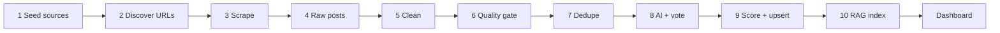

# Stage 1 Product Plan — Opportunity Command Center

**Project:** `phill-job-application-copilot`  
**Product name:** Opportunity Command Center (OCC)  
**Stage:** 1 — Intelligence, discovery, classification, scoring, and human review  
**Primary user:** Tapuwa Phill Mhembere  
**Definition of done:** Daily automated discovery produces classified, scored opportunities with evidence across four dashboard sections. The user can save, reject, note, and mark viewed — without sending applications or emails (Stage 2).

---

## 1. Product vision

Stage 1 is a **single-user command center** that replaces manual tab-hopping across job boards, PhD portals, freelance boards, and local classifieds. The system:

1. Discovers candidate URLs from curated sources and search terms.
2. Scrapes and cleans content ethically.
3. Classifies and scores opportunities against Phill’s profile.
4. Surfaces **evidence-backed** recommendations in four parallel pipelines.
5. Preserves user state (`viewed`, notes, status) across re-scrapes and deduplication.

Stage 1 explicitly **does not** submit applications, send email, or manage document versions in production workflows — those are Stage 2 placeholders.

---

## 2. User profile context — Tapuwa Phill Mhembere

All AI classification, scoring, and RAG retrieval are anchored to one canonical profile in `user_profiles` and related tables.

| Dimension | Context for matching |
|-----------|----------------------|
| **Identity** | Tapuwa Phill Mhembere (`display_name` / `legal_name`) |
| **Location** | Bremen, Germany (`location_city`, `location_country`) — primary market for client leads and on-site/hybrid jobs |
| **Secondary market** | South Africa — client leads and remote roles flagged `south_africa_focus` or `south_africa_friendly` |
| **Core skills** | Python, data science, machine learning, LLM/RAG, FastAPI, SQL, analytics engineering, actuarial-adjacent analysis, dashboards, API integration |
| **Client services** | Small-business IT help: websites, WordPress, digitization, Excel, automation, social media support, nonprofit/verein tech |
| **PhD interests** | Funded doctoral positions in data science, ML, NLP, RAG, computational statistics, explainable AI — **not** self-funded unless exceptional |
| **Job preferences** | Data/ML/LLM roles in Germany/EU; email application strongly preferred; deprioritize roles requiring native/C1 German unless otherwise justified |
| **Remote preferences** | Worldwide / EU / Africa-friendly remote; **deprioritize** `us_only_remote` and `hybrid_only` |
| **Languages** | English primary; German working proficiency — stored in `profile_preferences` and `languages` JSONB |
| **Documents** | CV, cover letter templates, portfolio snippets in `profile_documents` → chunked for Profile RAG |

Profile context is injected into:

- Classifier and extractor prompts (`ClassifierBrain` + future specialist brains).
- Rule-based scoring (`ScoringRules`).
- Profile RAG queries (`profile_knowledge_chunks` / Chroma collection `profile`).

---

## 3. Four dashboard sections

The React dashboard (`frontend/src/App.jsx`) routes four opportunity **categories** plus shared tooling.

| Section | Route | DB `category` / `target_section` | Purpose |
|---------|-------|-----------------------------------|---------|
| **Client Leads** | `/client-leads` | `client_lead` | Freelance/small-business technical work in Germany (local), global platforms, South Africa |
| **PhD** | `/phd` | `phd` | Funded doctoral and research positions |
| **Jobs** | `/jobs` | `job` | Employment in Germany/EU aligned with data/ML stack |
| **Remote Jobs** | `/remote` | `remote_job` | Location-independent roles with explicit remote proof |

### 3.1 Shared pages (all sections)

| Page | Route | Function |
|------|-------|----------|
| Overview | `/` | KPIs: new today, high priority, manual review queue size, source health |
| Opportunity detail | `/opportunity/:id` | Full record, evidence panel, score breakdown, category fields, Stage 2 disabled actions |
| Sources | `/sources` | Enable/disable sources, health scores, last run |
| Profile knowledge | `/profile` | Skills, experience, preferences, document chunks |
| Review queue | `/review` | `status = manual_review` or low agreement votes |
| Logs / health | `/logs` | Scrape runs, AI usage, errors |
| Settings | `/settings` | Schedules, limits, manual URL ingest |

### 3.2 Client Leads — tabs and filters

| Tab | Filter logic |
|-----|--------------|
| **Germany local** | `lead_region` in Bremen/Lower Saxony/Niedersachsen OR `country = Germany` AND `source_group` like `germany_local_%` |
| **Global** | `source_group` global platforms (Upwork-style, forums) — not DE-local classified |
| **South Africa** | `south_africa_focus = true` OR `country = South Africa` |
| **All** | `category = client_lead` |

| Filter | Values |
|--------|--------|
| Status | See §6 |
| Score band | See §5 |
| Contact type | email, phone, form, platform message |
| Viewed | viewed / unviewed |
| Service category | web, WordPress, automation, data, social, other |

### 3.3 PhD — tabs and filters

| Tab | Filter |
|-----|--------|
| Funded | `funding_status` in (`fully_funded`, `salaried_phd`, `scholarship_available`) |
| Unclear funding | `funding_status = unclear` |
| Email apply | `email_application_possible = yes` |
| Manual review | `status = manual_review` |

Required detail fields: `university`, `department`, `funding_status`, `funding_proof`, `deadline`, `application_email` + `email_proof`.

### 3.4 Jobs — tabs and filters

| Tab | Filter |
|-----|--------|
| High match | `final_score >= 80` |
| Email application | `email_application_possible = yes` |
| Germany | `country = Germany` |
| EU / other | `country` not Germany |

Deprioritize in UI sort (not hidden): listings with native German in `language_requirements`.

### 3.5 Remote Jobs — tabs and filters

| Tab | Filter |
|-----|--------|
| Worldwide | `remote_restriction = worldwide_remote` |
| EU remote | `eu_remote` |
| Africa / SA friendly | `africa_remote`, `south_africa_friendly` |
| Flagged US-only | `us_only_remote` — visible with warning badge |

Require `remote_proof` snippet for scores above 60.

---

## 4. End-to-end pipeline (steps 1–10)

| Step | Name | Input | Output | Owner |
|------|------|-------|--------|-------|
| **1** | Source seeding | JSON seed files | `sources`, `source_search_terms` | `scripts/seed_sources.py` |
| **2** | URL discovery | Sources + Tavily terms | `discovered_urls` (pending) | Daily scrape + Tavily |
| **3** | Scrape | Pending URLs | `raw_posts`, `scrape_jobs` | `ScraperRouter` |
| **4** | Raw persistence | ScrapeResult | `raw_posts` immutable audit | Ingestion service |
| **5** | Clean & normalize | raw HTML/text | `cleaned_posts`, `content_hash` | `run_cleaning_pipeline.py` |
| **6** | Quality gate | title + body | pass / fail / manual_review | `DataQualityGate` |
| **7** | Deduplication | cleaned + existing | merge or new `opportunities` | URL → content → semantic |
| **8** | AI analysis + voting | cleaned + profile RAG | `opportunity_ai_analysis`, `opportunity_votes` | `ClassifierBrain`, `VotingEngine` |
| **9** | Scoring & upsert | structured fields + rules | `opportunities`, detail tables, `opportunity_evidence` | `ScoringRules` |
| **10** | RAG index | opportunity text | Chroma + optional `opportunity_knowledge_chunks` | `ChromaStore` |

**Scheduling (UTC):**

| Workflow | Cron | Script |
|----------|------|--------|
| Daily scrape | `0 7 * * *` | `run_daily_scrape.py` |
| AI analysis | `30 8 * * *` | `run_ai_analysis.py` |
| RAG indexing | TBD | future `rag-indexing.yml` |
| Frontend deploy | push `main` | Cloudflare Pages |

---

## 5. Scoring bands

Final score is **0–100** (`opportunities.final_score`), composed in `ScoringRules._finalize` with weighted dimensions stored in `opportunity_scores`.

| Band | Range | UI label | Default action |
|------|-------|----------|----------------|
| **High priority** | 80–100 | 🔴 Act today | Pin to top; notify (future) |
| **Review recommended** | 60–79 | 🟡 Worth reading | Normal queue |
| **Manual review** | 40–59 | 🟠 Uncertain | Review queue |
| **Low / reject** | 0–39 | ⚪ Deprioritize | Hidden by default filter |

### 5.1 Score components (weights)

| Component | Weight | Notes |
|-----------|--------|-------|
| Profile match | 25% | Category-specific rules |
| Evidence quality | 20% | Snippets, funding proof, remote proof |
| Contact / apply method | 25% combined | contact 15% + application 10% |
| Country / remote fit | 10% | Bremen/DE/SA/EU/worldwide |
| Recency | 10% | Posted/deadline proximity |
| Source reliability | 5% | `sources.health_score` |
| Urgency | 5% | Deadline &lt; 14 days |
| Duplicate penalty | subtractive | Semantic duplicate merge |

Constants in code: `HIGH_PRIORITY = 80`, `REVIEW_RECOMMENDED = 60`, `MANUAL_REVIEW = 40`.

### 5.2 Category-specific scoring highlights

| Category | Boost | Penalize |
|----------|-------|----------|
| Client lead | Email/phone contact; DE/SA region; clear technical need | Unknown need; form-only |
| PhD | Funded/salaried; email apply; funding_proof | Self-funded; unclear funding |
| Job | Skill keyword hits; email apply | Native German requirement |
| Remote | worldwide_remote, sa_friendly | us_only_remote, hybrid_only |

---

## 6. Status enums

### 6.1 Opportunity lifecycle (`opportunities.status`)

| Status | Meaning | Set by |
|--------|---------|--------|
| `new` | First seen, not opened | System |
| `reviewing` | User opened detail | User / `open_count` |
| `saved` | User marked keep | User action |
| `rejected` | User dismissed | User action |
| `manual_review` | AI disagreement or low confidence | Voting engine |
| `archived` | Old or merged away | User / system |
| `stage2_ready` | Approved for future application flow | User toggles `approved_for_application` |

Transitions are logged in `opportunity_status_history`.

### 6.2 Discovery URL status (`discovered_urls.status`)

| Status | Meaning |
|--------|---------|
| `pending` | Queued for scrape |
| `scraped` | Raw post created |
| `failed` | Scrape exhausted fallbacks |
| `skipped` | Blocked source flags |

### 6.3 Quality status (`cleaned_posts.quality_status`)

| Status | Meaning |
|--------|---------|
| `passed` | Eligible for AI |
| `failed` | Rejected, no AI spend |
| `manual_review` | Captcha/login/weak quality |
| `needs_rescrape` | 403/blocked — try fallback scraper |

### 6.4 Funding status (PhD detail)

| Value | Scoring |
|-------|---------|
| `fully_funded` | High |
| `salaried_phd` | High |
| `scholarship_available` | High |
| `partially_funded` | Medium |
| `unclear` | Low-medium |
| `self_funded` | Very low (15 profile match) |

### 6.5 Remote restriction (remote detail)

| Value | Score (country dimension) |
|-------|---------------------------|
| `worldwide_remote` | 95 |
| `south_africa_friendly` | 90 |
| `eu_remote` | 88 |
| `africa_remote` | 85 |
| `germany_remote` | 75 |
| `us_only_remote` | 20 |
| `hybrid_only` | 10 |
| `unclear` | 40 |

### 6.6 Application method (`opportunities.application_method`)

`email`, `portal`, `form`, `platform_message`, `phone`, `unknown`

---

## 7. Evidence requirements

Every classification or score above **confidence 70** must include at least one `opportunity_evidence` row (enforced in `ai_json_validator.py`).

| Evidence type | Required when | Example snippet |
|---------------|---------------|-----------------|
| `funding_proof` | PhD score &gt; 60 | “TV-L E13 65% funded position” |
| `remote_proof` | Remote score &gt; 60 | “Work from anywhere in EU timezone” |
| `email_proof` | email_application_possible = yes | “Apply to phd@uni.de” |
| `deadline_proof` | urgency scoring | “Deadline: 15 June 2026” |
| `contact_proof` | client leads | Phone/email in body |
| `skill_proof` | job match | “Python, PyTorch, RAG” |
| `classification_reason` | all AI outputs | Model `reason` field |

Evidence UI on opportunity detail:

- Snippet text with highlight offset when available.
- Model name and confidence per row.
- Link back to `source_url` and `cleaned_posts` lineage.

---

## 8. User actions (Stage 1)

Stored in `opportunity_user_actions`:

| action_type | Effect |
|-------------|--------|
| `save` | `status → saved` |
| `reject` | `status → rejected` |
| `note` | `opportunity_notes` |
| `mark_viewed` | `viewed = true`, `viewed_at` |
| `approve_stage2` | `approved_for_application`, `stage2_ready` |
| `manual_url` | Creates discovery + scrape job from dashboard |

---

## 9. Categories and subcategories

| category | Example subcategories |
|----------|----------------------|
| `client_lead` | `web_development`, `wordpress`, `automation`, `data_analytics`, `social_media`, `unknown_technical_need` |
| `phd` | `data_science`, `machine_learning`, `nlp`, `statistics`, `interdisciplinary` |
| `job` | `data_scientist`, `ml_engineer`, `analytics_engineer`, `actuarial_analyst` |
| `remote_job` | `data_scientist`, `backend`, `full_stack`, `contract` |
| `manual_review` | fallback when models disagree |

---

## 10. Non-goals (Stage 1)

- No Gmail send/receive.
- No automated portal form submission.
- No public multi-tenant signup.
- No bypass of login walls or CAPTCHA.
- No creation of opportunities directly from Tavily snippets alone.

---

## 11. Success metrics

| Metric | Target |
|--------|--------|
| Daily new relevant opportunities | 5–30 across sections |
| False positive rate (user reject / save) | &lt; 30% for high-priority band |
| Duplicate rate after dedupe | &lt; 5% visible duplicates |
| Evidence coverage | 100% for confidence &gt; 70 |
| Scrape success rate per source | &gt; 70% rolling 7-day |
| Cloud AI calls / day | ≤ `AI_DAILY_CLOUD_CALL_LIMIT` (default 200) |

---

## 12. Related documentation

| Document | Topic |
|----------|-------|
| `stage-1-architecture.md` | Technical design |
| `source-strategy.md` | Seeds and search terms |
| `scraping-strategy.md` | Scraper streams |
| `ai-brain-rules.md` | Models and JSON schema |
| `database-schema.md` | Tables and indexes |
| `implementation-checklist.md` | Delivery verification |
