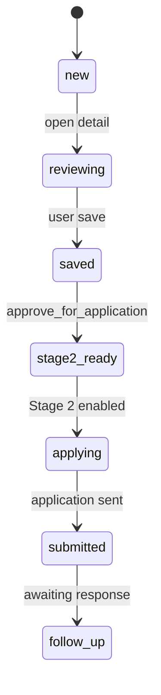
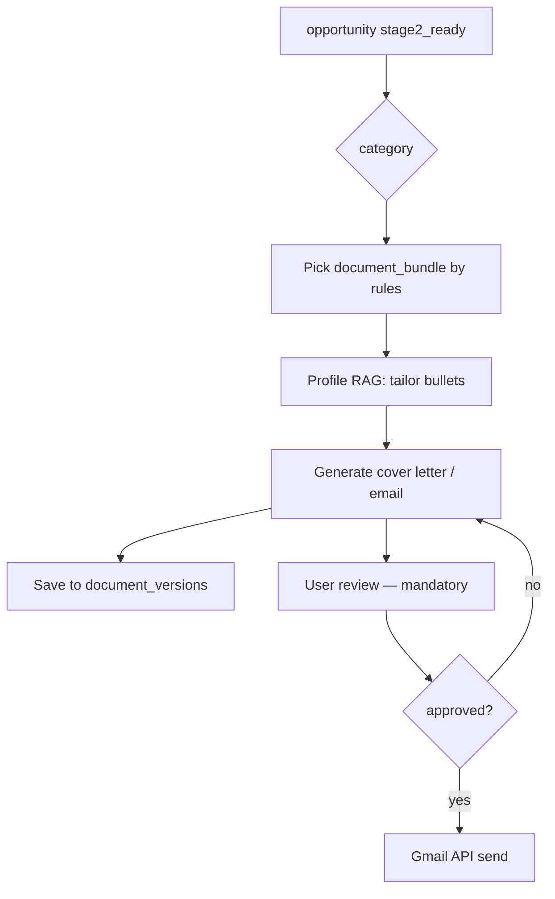

# Stage 2 Future Connection — Plug-In Design

**Stage 1 delivers:** Discovery, classification, scoring, evidence review, and `stage2_ready` gating.  
**Stage 2 delivers:** Application execution — documents, email, portals, follow-ups — **without rewriting Stage 1 schema**.

This document defines how Stage 2 connects to existing tables, UI placeholders, and backend extension points.

---

## 1. Stage boundary

| Capability | Stage 1 | Stage 2 |
|------------|---------|---------|
| Find opportunities | ✅ | ✅ (inherits) |
| Score and evidence | ✅ | ✅ |
| User save/reject/note | ✅ | ✅ |
| Generate cover letter | ❌ placeholder | ✅ |
| Send email application | ❌ | ✅ |
| Submit portal forms | ❌ | ✅ |
| Gmail thread sync | ❌ | ✅ |
| Document version control | Schema only | ✅ active |
| Follow-up reminders | Schema only | ✅ |

**Principle:** Stage 2 is a **plugin layer** on `opportunities` rows already approved by the user.

---

## 2. Activation gate



| Field / action | Meaning |
|----------------|---------|
| `opportunities.approved_for_application` | User explicit intent |
| `opportunities.stage2_ready` | System + user confirmation |
| `applications.stage2_ready` | Per-application pipeline ready |
| UI | “Apply”, “Draft email” buttons **disabled** until Stage 2 feature flag on |

### 2.1 Recommended feature flag

`system_settings` key:

```json
{
  "stage2_enabled": false,
  "gmail_connected": false,
  "auto_send_allowed": false
}
```

Stage 1 ships with `stage2_enabled: false`.

---

## 3. Database tables ready on day one

Group 7 from migration (`20260525100000_stage1_core_schema.sql`):

| Table | Stage 2 role |
|-------|--------------|
| `document_vault` | Master CV, cover letters, certificates |
| `document_versions` | Track edits per application |
| `document_bundles` | Named sets (e.g. “ML Engineer default”) |
| `document_bundle_items` | Ordered files in bundle |
| `applications` | One row per apply attempt |
| `application_documents` | Snapshot docs attached to send |
| `email_drafts` | Generated email bodies |
| `gmail_threads` | Synced thread IDs |
| `portal_application_tasks` | Step checklist for web portals |
| `follow_up_tasks` | Reminder schedule |
| `application_events` | Timeline audit |

### 3.1 Bridge columns on `opportunities` (already exist)

| Column | Stage 2 use |
|--------|-------------|
| `recommended_document_bundle` | FK → `document_bundles` |
| `required_documents` | JSON checklist from job ad |
| `application_url` | Primary apply link |
| `application_status` | draft / submitted / rejected |

---

## 4. UI plug-in design (disabled in Stage 1)

### 4.1 Opportunity detail — action bar

| Button | Stage 1 | Stage 2 |
|--------|---------|---------|
| Save / Reject / Note | Active | Active |
| Approve for application | Sets `stage2_ready` | Same |
| **Draft cover letter** | Disabled + tooltip “Stage 2” | Opens editor |
| **Draft email** | Disabled | Creates `email_drafts` |
| **Open portal checklist** | Disabled | `portal_application_tasks` |
| **Mark submitted** | Disabled | Updates `applications.status` |

CSS pattern: `.stage2-disabled { opacity: 0.5; pointer-events: none; }` with badge.

### 4.2 New routes (Stage 2)

| Route | Purpose |
|-------|---------|
| `/applications` | Pipeline kanban |
| `/applications/:id` | Single apply workflow |
| `/documents` | Vault manager |
| `/inbox` | Gmail threads |

Stage 1 `App.jsx` does not register these routes until flag enabled.

---

## 5. Backend module layout (planned)

```
backend/app/stage2/          # NEW package — not imported in Stage 1 cron
  ├── application_service.py
  ├── email_generator.py
  ├── gmail_sync.py
  ├── portal_checklist.py
  └── document_selector.py   # uses Profile RAG + bundle rules
```

**Import rule:** `run_daily_scrape.py` and `run_ai_analysis.py` must **never** import `stage2` to avoid accidental sends.

---

## 6. Stage 2 workflows (future GitHub Actions)

| Workflow | Trigger | Action |
|----------|---------|--------|
| `stage2-email-draft.yml` | manual | Generate drafts only — no send without approval |
| `gmail-sync.yml` | cron | Pull replies into `gmail_threads` |
| `follow-up-reminder.yml` | daily | Notify due `follow_up_tasks` |

All require `stage2_enabled` check in script entrypoint.

---

## 7. Document selection logic (design)



| Category | Default bundle |
|----------|----------------|
| `job` | CV + cover letter + portfolio link |
| `phd` | Academic CV + research statement |
| `remote_job` | CV + short remote cover |
| `client_lead` | Service one-pager + rate card (future) |

`opportunities.recommended_document_bundle` set by rules engine in Stage 2 prep step.

---

## 8. Email and Gmail integration (design only)

| Component | Design |
|-----------|--------|
| Auth | OAuth refresh token in GitHub Secret — **not** in frontend |
| Send | Server-side only after `email_drafts.status = approved` |
| Storage | `gmail_threads.thread_id` + `application_events` |
| Safeguard | No auto-send in Stage 2 MVP without second confirmation |

Stage 1: **no Gmail env vars** in `.env.example` — add in Stage 2 migration doc.

---

## 9. Portal application tasks

For `application_method = portal`:

1. Parse listing into checklist JSON (AI-assisted).
2. Store in `portal_application_tasks.checklist`.
3. UI shows manual steps — human completes browser.
4. Optional future: Playwright assist **with explicit user trigger** (out of initial Stage 2 scope).

---

## 10. RAG reuse in Stage 2

| Stage 1 asset | Stage 2 use |
|---------------|-------------|
| Profile RAG chunks | Tone and skill emphasis in letters |
| Opportunity RAG | Mirror language from job ad |
| `opportunity_evidence` | Cite funding/remote facts in cover letter |

No re-embedding required if Chroma/pgvector current.

---

## 11. API additions (Supabase Edge Functions — optional)

| Endpoint | Purpose |
|----------|---------|
| `POST /stage2/draft-email` | Create `email_drafts` |
| `POST /stage2/approve-send` | Send after review |
| `GET /stage2/applications` | List pipeline |

Keep service role on server; frontend uses user JWT + RLS on `applications`.

---

## 12. Migration path from Stage 1 → Stage 2

| Step | Action |
|------|--------|
| 1 | Complete Stage 1 checklist |
| 2 | Populate `document_vault` with master CV |
| 3 | Set `system_settings.stage2_enabled = true` |
| 4 | Deploy Stage 2 frontend routes |
| 5 | Enable Gmail OAuth |
| 6 | Pilot on 1 `stage2_ready` opportunity |
| 7 | Enable batch draft (not send) |
| 8 | Enable send with double approval |

**No breaking schema changes required** if Group 7 tables already applied.

---

## 13. Data retention across stages

| Data | Retention |
|------|-----------|
| `opportunity_evidence` | Permanent audit |
| `email_drafts` | Keep all versions |
| `application_events` | Append-only |
| Sent emails | Also in Gmail; local copy in `email_drafts` |

---

## 14. Risks specific to Stage 2 (preview)

| Risk | Mitigation |
|------|------------|
| Auto-send wrong employer | Mandatory human approve; no cron send |
| Wrong CV version attached | `document_versions` + preview step |
| Gmail token leak | Server-only secret; rotate |
| Portal bot violation | Human-in-the-loop checklist only |

Full register extension in Stage 2 spec (future doc).

---

## 15. What Stage 1 must leave ready

| Item | Location |
|------|----------|
| `stage2_ready` column | `opportunities` |
| Group 7 tables | migration applied |
| Disabled UI buttons | Opportunity detail |
| `approved_for_application` workflow | User action |
| Evidence on high scores | AI validator |
| Document bundle FK nullable | `recommended_document_bundle` |

---

## 16. Related documentation

| File | Topic |
|------|-------|
| `stage-1-product-plan.md` | Stage 1 scope |
| `database-schema.md` | Group 7 tables |
| `rag-strategy.md` | Letter grounding |
| `loopholes-and-safeguards.md` | R19 Stage 2 button safeguard |
| `implementation-checklist.md` | Stage 2 readiness section |
